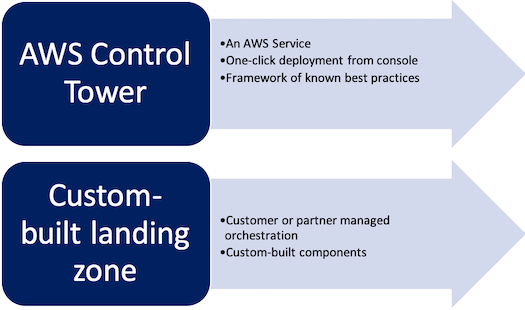

# AWS Landing Zone

## Landing Zone Overview

AWS Landing Zone helps customers more quickly set up a secure, multi-account AWS environment based on AWS best practices. With the large number of design choices, setting up a multi-account environment can take a significant amount of time, involve the configuration of multiple accounts and services, and require a deep understanding of AWS services.

AWS Landing Zone can help save time by automating the set-up of an environment for running secure and scalable workloads while implementing an initial security baseline through the creation of core accounts and resources. It also provides a baseline environment to get started with a multi-account architecture, identity and access management, governance, data security, network design, and logging.

  

### AWS Organization account
The AWS Landing Zone is deployed into an AWS Organizations account. This account is used to manage configuration and access to AWS Landing Zone managed accounts. The AWS Organizations account provides the ability to create and financially manage member accounts. It contains the AWS Landing Zone configuration Amazon Simple Storage Service (Amazon S3) bucket and pipeline, account configuration StackSets, AWS Organizations Service Control Policies (SCPs), and AWS Single Sign-On (SSO) configuration.

### Shared Services account
The Shared Services account is a reference for creating infrastructure shared services such as directory services. By default, this account hosts AWS Managed Active Directory for AWS SSO integration in a shared Amazon Virtual Private Cloud (Amazon VPC) that can be automatically peered with new AWS accounts created with the Account Vending Machine (AVM).

### Log Archive account
The Log Archive account contains a central Amazon S3 bucket for storing copies of all AWS CloudTrail and AWS Config log files in a log archive account.

### Security account
The Security account creates auditor (read-only) and administrator (full-access) cross-account roles from a Security account to all AWS Landing Zone managed accounts. The intent of these roles is to be used by a company's security and compliance team to audit or perform emergency security operations in case of an incident.

## Custom-built landing zone

You can choose to build your own customized landing zone solution. In this case, you have to implement the baseline environment to get started with identity and access management, governance, data security, network design, and logging. We recommend this approach if you want to build all of your environment components from scratch, or if you have requirements that only a custom solution can support. You must have enough expertise in AWS to manage, upgrade, maintain, and operate the solution once it’s deployed.

However, before you move forward with a customized landing zone design, we recommend that you consider AWS Control Tower first. AWS Control Tower has been customized and used by many customers across industries to successfully deploy workloads on AWS. 

## Implementation Options

### Options for landing zones on AWS

  

    
### Delivery Mechanism

Delivery mechanism showing the differences between AWS Control Tower and a customized landing zone that is managed by the customer or partner

  

### Controle Tower

  

### Pulumi AWS Landing Zone

## Reference
- https://docs.aws.amazon.com/prescriptive-guidance/latest/security-reference-architecture/architecture.html
- https://github.com/dishu2511/pulumi-aws-crossaccount-infratructure-pipeline
